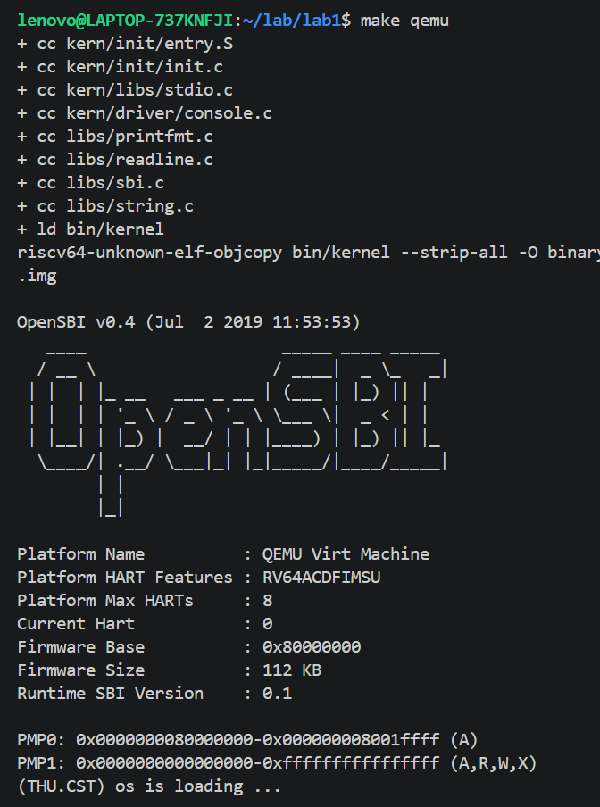
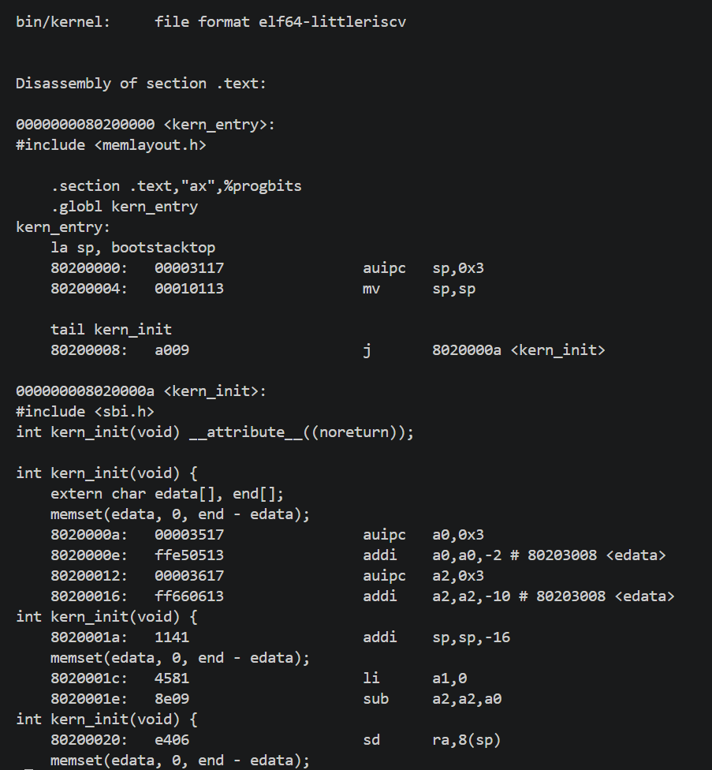
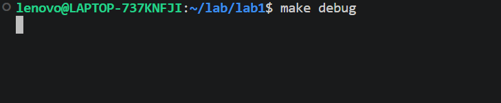
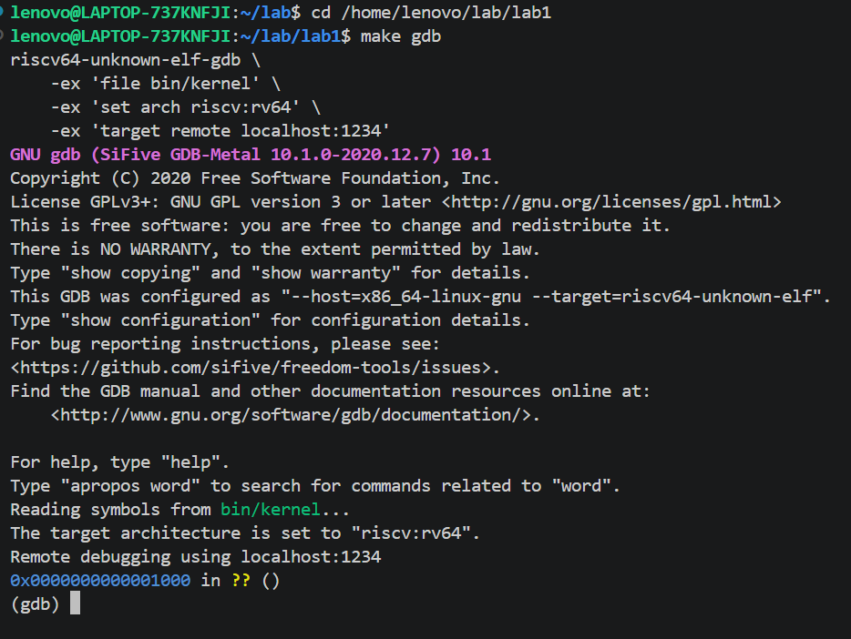
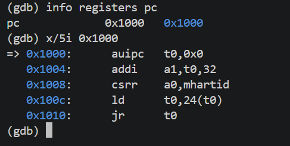
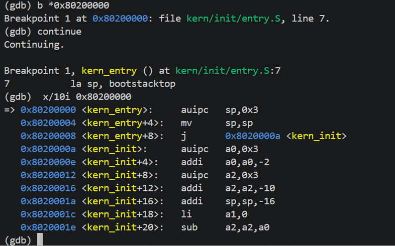
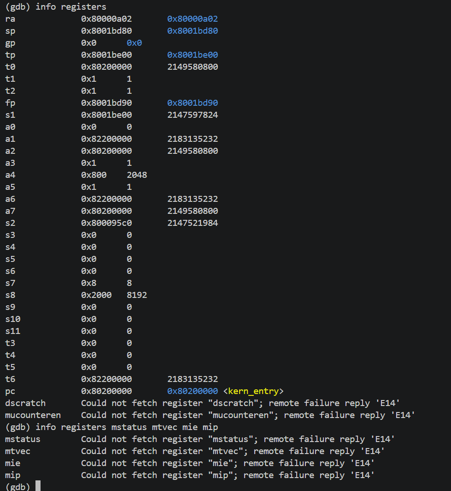
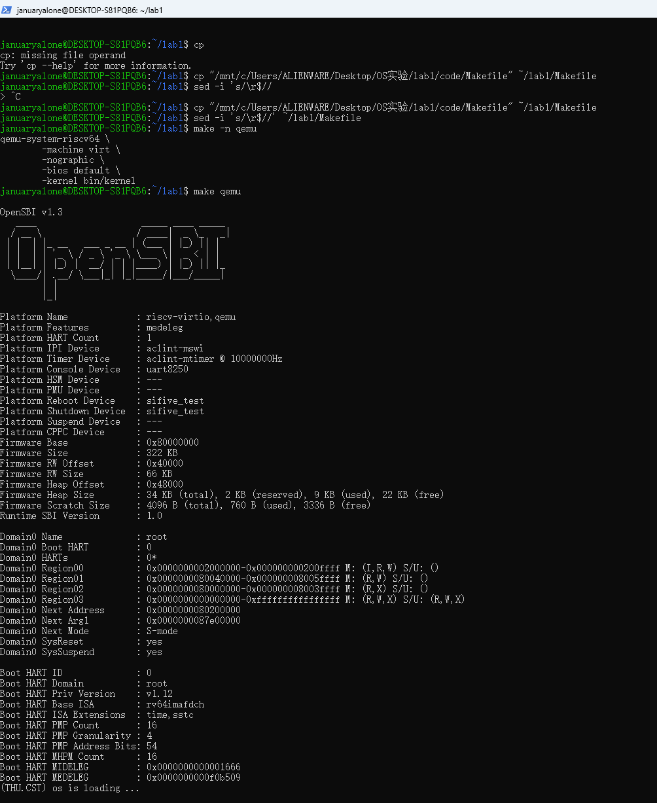
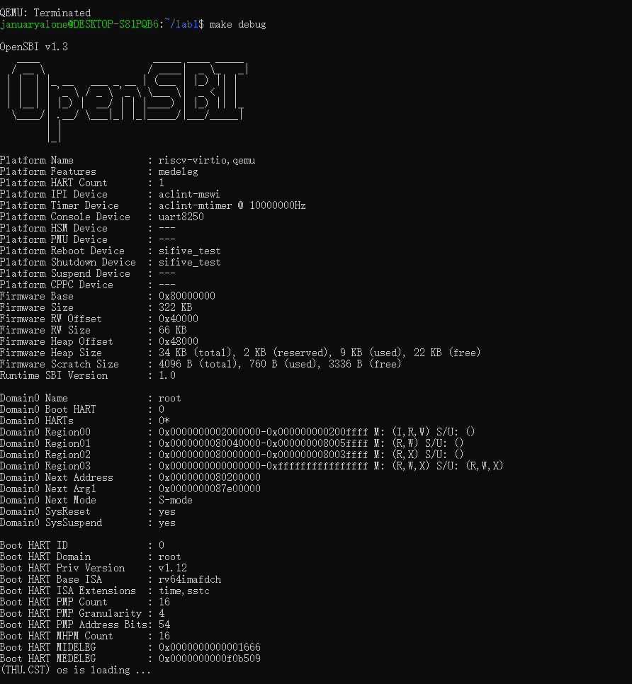

# 实验报告

## 实验基本信息

| 项目 | 内容 |
|------|------|
| **实验名称** | Lab 1: uCore 内核启动流程分析与调试 |
| **小组成员** | 2510789 徐康怀、2514022 邓翔予、2510538 张铭瑞 |
| **完成日期** | 2026.9.26 |

### 小组分工

练习如何分工？

| 成员 | 负责的练习/模块 |
|------|----------------|
| 2510789徐康怀 | 练习 1 报告章节：理解内核启动流程（entry.S 关键指令分析） |
| 2514022邓翔予 | 练习 2 报告章节：使用 GDB 验证启动流程（QEMU + GDB 调试） |
| 2510538张铭瑞 | 整体逻辑分析（第三章）、测试与验证（第五章）、实验总结与收获（第六章） |

实验报告如何分工？

三名成员均独立完成了全部实验流程（环境搭建、make qemu 运行、entry.S 精读、GDB 调试验证）；报告撰写按章节分工：2510789 徐康怀执笔练习 1 章节，2514022 邓翔予执笔练习 2 章节，2510538 张铭瑞执笔整体逻辑分析、测试验证与总结收获章节。

---

## 一、实验目的

本实验的主要目的是：

1. 理解操作系统内核从裸机加电到进入 C 语言世界的完整启动链路，掌握 RISC-V 平台加电后的第一条指令地址与固件（OpenSBI）的作用。
2. 读懂 uCore-Lab1 的内核入口汇编 `kern/init/entry.S`，明确"搭栈"与"跳转进 C"两条关键指令的语义与设计动机。
3. 掌握 QEMU 与 GDB 的联合调试方法，能够通过反汇编与断点验证地址接力过程（0x1000 → 0x80000000 → 0x80200000）。
4. 学会使用 AI 辅助阅读操作系统源码，将生僻的汇编/CSR 概念转化为可验证的实验证据。

---

## 二、实验环境

本组使用两套相互独立的环境完成实验，形成跨版本对照（两套环境的差异是第五章根因分析的关键证据）：

| 项目 | 张铭瑞（本机） | 邓翔予 |
|------|---------------|--------|
| 操作系统 | Windows 11 + WSL2（Ubuntu 24.04） | Windows + WSL2（Ubuntu 22.04） |
| 交叉编译工具链 | riscv64-unknown-elf-gcc 13.2.0 | SiFive GNU Embedded Toolchain 10.2.0 |
| 模拟器 | QEMU 8.2.2 | QEMU 4.1.1（源码编译） |
| 固件（`-bios default`） | OpenSBI v1.3（fw_dynamic） | OpenSBI v0.4（fw_jump） |
| 内核加载方式 | `-kernel bin/kernel`（原因见第五章） | `-device loader,addr=0x80200000` |

使用的 AI 工具

| 成员 | AI 编程工具 | 底层模型 | 备注 |
|------|------------|---------|------|
| 2510789徐康怀 | WorkBuddy | GLM-5.3-Flash | 用于练习 1 源码逐行讲解 |
| 2514022邓翔予 | WorkBuddy | Hunyuan-4（混元4） | 用于练习 2 调试流程梳理 |
| 2510538张铭瑞 | WorkBuddy | DeepSeek-V4.1-Flash / Kimi-K3 | 用于环境排障、报告撰写与排版 |

**说明：**
- **AI 编程工具**：指具体使用的终端工具、编辑器插件、桌面应用或浏览器界面
- **底层模型**：指该工具使用的大语言模型及版本

图 1　`make qemu` 运行输出（含 OpenSBI banner 与内核启动信息）



---

## 三、实验整体逻辑分析

**执笔：** 2510538张铭瑞

### 3.1 本章节的逻辑主线

本章围绕"**操作系统内核是如何被拉起来的**"展开，核心是一条**三级地址接力链**：

1. **硬件复位**：CPU 加电后 PC 由硬件固定到复位向量 `0x1000`，执行掩膜 ROM 中几条位置无关指令——用 `auipc` 以当前 PC 为锚点取址，读 hart ID（`csrr a0,mhartid`）、设备树地址，并把 `fw_dynamic_info` 结构地址放入 `a2`；
2. **固件接力**：跳转 `0x80000000`，M 态固件 OpenSBI 完成硬件初始化（异常入口、PMP、串口）并打印 banner，随后按上一阶段提供的 `next_addr` 跳转（本机实测其值为 `0x80200000`）；
3. **进入内核**：跳转 `0x80200000`，CPU 控制权第一次交给 uCore 自己的代码——`kern_entry`。

整个实验要回答的问题是：**为什么 C 写的内核不能"从第一条指令直接开始跑"？** 因为 C 代码的运行依赖栈，而栈必须由汇编在上电最初准备；在此之前还必须由固件把机器初始化到"可执行 C 代码"的最低标准。

**本实验最重要的一个观察**：`0x80200000` 这个地址在两种固件中含义完全不同——在旧固件 `fw_jump`（QEMU ≤5.1 默认）中它是**编译期常量**（跳转地址写死在固件里，加载到哪就跳到哪）；在现行固件 `fw_dynamic`（QEMU ≥5.2 默认）中它是**运行时参数**（由上一阶段通过 `fw_dynamic_info.next_addr` 传入）。接力链的形态没变，但"地址从哪来"的契约变了——本组两套环境的对照实验证实了这一点，详见第五章。

### 3.2 功能的逐步实现

1. **先跑通 `make qemu`** → 确认构建链路（交叉编译 → 链接 → objcopy → QEMU 加载 → 固件交权）端到端通畅，后续分析才有可观测的载体；
2. **再精读 `kern/init/entry.S`** → 它是接力链最后一棒的着陆点，也是全实验唯一需要理解的汇编：`la sp, bootstacktop`（搭栈，进入 C 世界的前提，展开为 `auipc`+`addi` 两条）、`tail kern_init`（尾跳转不保存返回地址，与 `noreturn` 语义精确对齐）；
3. **最后用 QEMU + GDB 反向验证** → 在 `0x1000` 观察复位指令、在 `0x80200000` 下断点，把静态推理变成动态证据；`entry.S` 源码、`hexdump` 机器码、GDB 运行时反汇编三方一致，静态分析方可确信。

---

## 四、实验内容与实现

说明：本部分按照 exercises 文档中的练习顺序组织；每个功能模块或者练习中可能包含多项任务，可根据实际情况调整。

### 练习 1：理解内核启动流程（entry.S 关键指令分析）

**负责人：** 2510789徐康怀

#### 涉及的源码位置

| 文件路径 | 行号 | 关键内容 |
|---------|------|---------|
| `kern/init/entry.S` | 6 | `kern_entry:` 内核入口标号 |
| `kern/init/entry.S` | 7 | `la sp, bootstacktop` |
| `kern/init/entry.S` | 9 | `tail kern_init` |
| `kern/init/entry.S` | 11–18 | `.data` 段中的 bootstack 定义 |
| `kern/init/init.c` | 4 | `int kern_init(void) __attribute__((noreturn));` |
| `kern/init/init.c` | 6–14 | `kern_init` 函数体（清 BSS、打印、死循环） |

#### 源码原文（kern/init/entry.S）

```asm
#include <mmu.h>
#include <memlayout.h>

    .section .text,"ax",%progbits
    .globl kern_entry
kern_entry:
    la sp, bootstacktop

    tail kern_init

.section .data
    # .align 2^12
    .align PGSHIFT
    .global bootstack
bootstack:
    .space KSTACKSIZE
    .global bootstacktop
bootstacktop:
```

```c
int kern_init(void) __attribute__((noreturn));

int kern_init(void) {
    extern char edata[], end[];
    memset(edata, 0, end - edata);

    const char *message = "(THU.CST) os is loading ...\n";
    cprintf("%s\n\n", message);
   while (1)
        ;
}
```

#### 问题 1：`la sp, bootstacktop` 完成了什么操作，目的是什么？

操作是把 bootstacktop 的地址放到 sp 寄存器。
目的是提前给 C 语言建立一个栈空间，因为 C 语言代码在运行的时候需要栈来存放，但一开始不具备栈，所以需要手动来创建一个。

#### 问题 2：`tail kern_init` 完成了什么操作，目的是什么？

操作是把 kern_init 地址放到 PC 中，把程序控制权交给 kern_init。
目的是开始运行 kern_init 主程序，而且 tail 不存放返回的地址，因为后续不需要返回。


图 2　`kern_entry` 处反汇编片段（静态证据）



### 练习 2：使用 GDB 验证启动流程

**负责人：** 2514022邓翔予

#### 模块功能描述

**需要执行的操作：**

```bash
# 终端 A：启动 QEMU 并在第一条指令前冻结 CPU
make debug

# 终端 B：连接 GDB
make gdb
# 等价于：
# riscv64-unknown-elf-gdb \
#   -ex 'file bin/kernel' \
#   -ex 'set arch riscv:rv64' \
#   -ex 'target remote localhost:1234'

# GDB 内操作
(gdb) info registers pc
(gdb) x/5i 0x1000
(gdb) b *0x80200000
(gdb) continue
(gdb) info registers
(gdb) info registers mstatus mtvec mie mip
```

**功能说明：**

- `make debug` 实际命令为 `qemu-system-riscv64 -machine virt -nographic -bios default -kernel bin/kernel -s -S`（加载方式在第五章说明）。其中 `-s` 开启 1234 端口的 gdbserver，`-S` 使 CPU 在上电后立即冻结（尚未执行第一条指令），这是能够捕获复位瞬间状态的必要条件。
- 本练习的目标是用动态证据复现练习 1 中的静态推断：确认 CPU 复位后第一条指令位于何处、经过哪些中间环节、最终如何抵达 `0x80200000` 的 `kern_entry`。
- 注意：**不要用 `si` 单步穿越 OpenSBI**（其指令数以千计），标准做法是直接在 `0x80200000` 下断点后 `continue`。
- 退出 QEMU（`nographic` 模式）：先按 `Ctrl+A`，松开后按 `X`。`Ctrl+C` 无效。

#### 调试过程记录

##### 第一步：准备环境

```bash
riscv64-unknown-elf-gdb --version   # 确认工具链自带 RISC-V 版 GDB
make clean && make qemu             # 先确认基线版本可构建可运行
```

图 3　`make qemu` 完整输出：编译链接 + OpenSBI banner + `(THU.CST) os is loading ...`


##### 第二步：启动受控 QEMU（终端 A）

```bash
make debug
```

此时 QEMU 冻结在 0x1000，等待 GDB 连接，终端挂起无输出属正常现象。

图 4　终端 A 执行 `make debug` 后挂起，等待 GDB 连接



##### 第三步：连接 GDB（终端 B）

```bash
make gdb
```

图 5　终端 B 执行 `make gdb`，GDB 连接成功



##### 第四步：观察复位向量（0x1000）

```bash
(gdb) info registers pc
pc             0x1000
(gdb) x/5i 0x1000
```

**观察结果：** CPU 上电后 PC 位于 **0x1000**，这是 QEMU `virt` 机器的复位向量（一块只读的掩膜 ROM），其中存放的是 QEMU 硬连线写入的几条初始化指令，而非我们的任何代码。

图 6　CPU 复位后 PC 停在 0x1000，`x/5i 0x1000` 显示复位向量处的指令



##### 第五步：追踪到内核第一条指令（0x80200000）

```bash
(gdb) b *0x80200000
(gdb) continue
(gdb) x/10i 0x80200000
```

**观察结果：** 断点命中后，反汇编显示的第一条指令与 `obj/kernel.asm` 中 `kern_entry` 标号处的指令完全一致（`auipc/addi` 形式的 `la sp, bootstacktop`），证明 0x80200000 正是内核文本的入口。

图 7　断点 `*0x80200000` 命中，此处即 `kern_entry`



##### 第六步：观察 CSR 状态（加分项）

```bash
(gdb) info registers
(gdb) info registers mstatus mtvec mie mip
```

**观察结果：** 记录此时的特权级状态、`a0`（hart ID）、`a1`（设备树 DTB 地址）、`mtvec` 等关键寄存器值，用以佐证 OpenSBI 已完成哪些初始化工作。

图 8　通用寄存器与关键 CSR（mstatus / mtvec / mie / mip）



#### 问题回答

**问题 1：RISC-V 硬件加电后最初执行的几条指令位于什么地址？**

位于 **0x1000**（QEMU `virt` 机器的复位向量地址），位于物理内存底部的一段只读掩膜 ROM 中。这些指令不属于 uCore 代码，是 QEMU 虚拟硬件提供的固件。它会立即跳转到 **0x80000000**（OpenSBI 入口），OpenSBI 初始化完毕后最终跳转到 **0x80200000**（内核加载地址）。

**问题 2：它们主要完成了哪些功能？**

分两段：

1. **0x1000 处的几条裸机指令**（掩膜 ROM）：用 `auipc + addi` 这种位置无关的方式组合出跳转目标 `0x80000000`（因为它不知道自己被映射到哪里）；同时把 `a0` 设为当前 hart ID、`a1` 设为设备树（DTB）的物理地址，作为传给下一棒的参数；最后 `jr` 跳转。
2. **0x80000000 处的 OpenSBI**（M 态固件，由 `-bios default` 加载）：完成机器模式的最小初始化，包括设置异常入口 `mtvec`、配置 PMP 物理内存保护、异常/中断委托、探测并初始化串口（屏幕上出现的 OpenSBI banner 即由它输出）、准备 hart 启动参数；最后按照默认 payload 地址 `FW_JUMP_ADDR = 0x80200000` 跳转。

只有当 OpenSBI 完成这一跳，**uCore 的 `kern_entry` 才第一次真正取得 CPU 控制权**。这也解释了 `0x80200000` 的由来：它不是随意选的，而是紧跟固件之后（`0x80000000` + 2MB）的标准 payload 落点。而"如何把这个地址交给固件"在新旧 QEMU 下有完全不同的答案，本组实测结论见第五章。

#### 关键洞察

**地址 0x80200000 不是巧合。** 它是"固件区 + 固件预留空间"之后的标准内核起始地址（`0x80000000` + 2MB）。但"如何让固件收到这个地址"取决于固件类型：`fw_jump` 把它编译进固件本身，`fw_dynamic` 要求上一阶段通过 `fw_dynamic_info.next_addr` 显式传入——而 QEMU 中只有 `-kernel` 路径会填充该字段（`-device loader` 不参与启动协议）。本组在 QEMU 8.2.2 上遇到的"banner 正常却无内核输出"即由此引发，详见第五章。三级接力 `0x1000 → 0x80000000 → 0x80200000` 本质上就是"**硬件约定 → 固件初始化 → 操作系统接管**"这一通用启动模型在 RISC-V 平台上的具体体现。

---

## 五、测试与验证

**执笔：** 2510538张铭瑞

**测试项与结果：**

| # | 测试项 | 命令 / 操作 | 结果 | 截图 |
|---|--------|------------|------|------|
| 1 | 构建与运行 | `make qemu` | OpenSBI banner 完整，随后打印 `(THU.CST) os is loading ...` 并进入死循环（`init.c` 末行 `while(1)`，预期行为） | make-qemu-thu-cst.png |
| 2 | 调试模式启动 | `make debug` | banner 显示 `Domain0 Next Address = 0x80200000`、Next Mode = S-mode | qemu-debug-next-addr.png |
| 3 | 调试模式完整运行 | `make debug` + `make gdb` + `continue` | 内核完整运行至 `(THU.CST)` 输出 | qemu-debug-thu-cst.png |
| 4 | 复位向量观察 | `x/5i 0x1000` | 掩膜 ROM 的地址接力指令（位置无关取址 + 参数准备） | gdb-rom-0x1000.png |
| 5 | 内核入口断点 | `b *0x80200000` + `continue` | 断点命中 `kern_entry`（`entry.S:7`），源码级符号对齐 | gdb-kern-entry-hit.png |
| 6 | 三方一致性 | `x/4i $pc` | 反汇编 = `auipc sp,0x3` / `addi sp,sp,0` / `c.j kern_init`，与 `entry.S` 源码、`hexdump` 机器码逐条一致 | gdb-kern-entry-hit.png |
| 7 | 寄存器与 CSR | `info registers`；`info registers mstatus mtvec mie mip` | `a0=0`（hart ID）、`a1=0x87e00000`（设备树地址，与 banner Next Arg1 一致）、`mtvec=0x80000428` | gdb-kern-entry-hit.png、gdb-csr.png |

**排障记录：新版 QEMU 下"banner 正常但内核未执行"**

两套环境交叉验证（见第二章）：旧环境（QEMU 4.1.1 / OpenSBI v0.4）一次跑通，新环境（QEMU 8.2.2 / OpenSBI v1.3）内核不被执行。排查与修复过程：

1. **现象**：`make qemu` 仅有 OpenSBI banner，无 `(THU.CST)`；`make debug` 下 `b *0x80200000` 断点不命中，中断后 `pc = 0x80000428`（OpenSBI trap 处理入口）；banner 中 `Domain0 Next Address = 0x0`。
2. **排查**：`hexdump` 解码 `bin/ucore.img` 开头，与 `entry.S` 逐条对应 → 产物无罪；整理结构化文档进行交叉会诊，并以 `-kernel` 手测作为判据实验。
3. **根因**：QEMU 5.2 起 virt 默认固件由 `fw_jump` 换为 `fw_dynamic`。`fw_jump` 的跳转地址是编译期常量（`FW_JUMP_ADDR = 0x80200000`）；`fw_dynamic` 要求上一阶段通过 `fw_dynamic_info.next_addr` 传入地址，而 QEMU 仅在 `-kernel` 路径填充该字段（`riscv_rom_copy_firmware_info()`），`-device loader` 不参与该启动协议 → `next_addr = 0`，OpenSBI 跳转 `0x0`、取指异常反复回弹（内核尚未设置 `stvec`），内核从未被执行。
4. **修复**：`Makefile` 的 `qemu`/`debug` 两目标由 `-device loader,file=$(UCOREIMG),addr=0x80200000` 改为 `-kernel bin/kernel`，并在 Makefile 中注释原因。修复后上表全部通过。
5. **一条被证伪的假设（保留记录）**：排查中曾假设"新固件废弃 legacy console 调用（`SBI_CONSOLE_PUTCHAR = 1`）导致字符被丢弃"。经查证 OpenSBI 至今保留 `CONFIG_SBI_ECALL_LEGACY`（**弃用 ≠ 移除**），`libs/sbi.c` 无需修改——该假设被证据推翻，避免了误改源码。
6. **补充观察**：`-device loader` 路径下 7 次运行的 banner `Next Address` 均为 `0x0`，无例外；其与内核加载方式的交互细节属 QEMU 内部实现，未在本实验范围内进一步追查。

**截图：**

图 9　修复后 `make qemu` 成功打印 `(THU.CST) os is loading ...`



图 10　`make debug` 调试模式下同样完整运行



---

## 六、实验总结与收获
**执笔：** 2510789徐康怀 2510538张铭瑞 2514022邓翔予

### 对操作系统的理解

**1. make 是如何把源码变成可引导的操作系统镜像的。** 分三步：交叉编译（在 x86-64 的 Ubuntu 上，用 riscv64-unknown-elf-gcc 把 C 和汇编编成 RISC-V 机器码）、链接（ld 按照 kernel.ld 把代码摆放到 0x80200000，这是和 OpenSBI 约好的交权地址）、objcopy"去壳"（把 ELF 剥成纯二进制 ucore.img——因为启动这一刻还没有任何加载器能解析 ELF 格式）。

**2. make qemu 是如何把程序跑起来的。** 上电复位后 CPU 从 0x1000 的掩膜 ROM 起跑，跳到 0x80000000 的 OpenSBI 固件，固件初始化硬件、打印 banner，然后把 CPU 降到 S 态、交到 0x80200000 的内核入口 kern_entry；汇编搭好栈后跳进 C 函数 kern_init，打印 `(THU.CST) os is loading ...`，最后进入 `while(1)` 死循环。

**3. cout 想要输出，到底要经过谁。** 课上讲过：cout 自己无权输出，必须调用操作系统内核。那操作系统又找谁完成这一步？本实验给了我看得见的答案：在 RISC-V 上，内核自己也不能直接碰串口硬件，要再用 `ecall`（SBI 调用）请求 M 态的 OpenSBI 固件代写。syscall 老师课上只讲了皮毛（详细讲解在本学期靠后的位置），这次相当于提前见到了它的下层版本。

**4. CPU 的三种模式。** M 态（机器态，跑固件 OpenSBI，权限最高）、S 态（监管态，跑操作系统内核）、U 态（用户态，跑应用程序）。同一条 `ecall` 指令，在 U 态执行叫系统调用，在 S 态执行叫 SBI 调用——都是低权限向高权限请求服务。

**5. 只有亲手跑过才知道的事：报错会被 `while(1)` 掩盖。** 内核正常跑完的样子，是打印一句话然后死循环，屏幕静止不动；而我的内核根本没被执行时（固件把 CPU 交给了地址 0），屏幕也是静止不动。**"正常跑完"和"根本没跑"在屏幕上长得一模一样**——该出现的输出一旦被吞掉，肉眼无法区分，只能上 GDB 看 PC 到底停在哪里，才知道真相。不亲手踩一次，永远不会知道"看起来没问题"和"真的没问题"之间差多远。

**6.操作系统涉及到计算机底层的操作，需要我们对计算机硬件有一定的理解**

**7.操作系统非常重要，是软件运行的基础**

**OS 原理中很重要、但本实验没有覆盖的知识点**：中断与异常处理（stvec/trapframe）、虚拟内存与页表、进程与调度、完整的系统调用链路（U→S 一侧）。其中中断异常我在排障中已经提前感受过一次：内核还没设置 stvec 时，异常会在固件和内核之间无限回弹，机器安静"假死"，却没有任何报错。

### AI 协作开发的经验

1. ai目前还不会把问题结构化处理，所以必须要人工给ai一个框架，ai再去填充，而不是让ai从头开始完整搭建一个项目。

2. agent可以帮我写代码，但是配置环境和可执行的环节必须亲手做，必须能够自己亲自说出报告里的每一张截图是什么意思，这样才算用ai辅助学习。

3. ai只适合提供意见，而最终思考和做决定的必须是人类自己。ai可以帮我在海量的资源中提取信息并且翻译成我能听懂的语言，甚至可以帮我做一个todo list，但是最终的决策权必须牢牢掌握在我自己的手里。

4. 我们不能一味地让ai思考和执行，在关键的地方需要人类把关，才能高效率高质量地完成一项任务

5. ai容易在一个地方钻牛角尖，而不是换个思路去找别的方法，需要人类在这种时候人为改变ai的方向